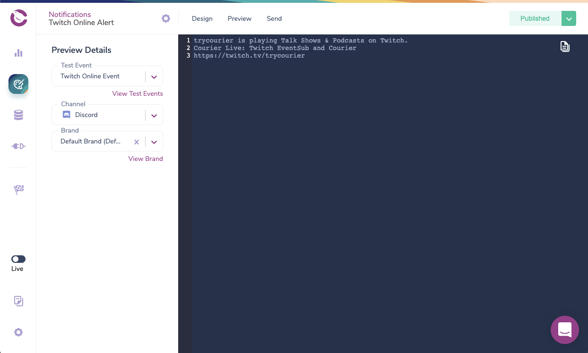

Content, Notifications and IoT
=====


What is this about?
=====

[](https://www.youtube.com/watch?v=7wYv2RI6aag&feature=youtu.be "Content, Notifications and IoT Part 1")
[](https://www.youtube.com/watch?v=IeX4v0Z56sc&feature=youtu.be "Content, Notifications and IoT Part 2")

Inspired by an [art installation in the lobby of the New York Times](https://www.nytimes.com/2007/10/25/arts/design/25vide.html), [@itsaydrian](https://twitter.com/itsaydrian) streamed using the Adafruit MagTag. We connected it to the Contentful API to show a series of rotating headlines.

If a user is interested in what they see on screen they'll be able to hit one of the buttons to send a notification out via the Courier API. In this project we're sending the notification via Discord, but you can replace it with any other API that Courier supports.

Check out our [first stream where we setup the MagTag to consume content](https://www.youtube.com/watch?v=7wYv2RI6aag&feature=youtu.be) and our [second stream where we enabled notifications](https://www.youtube.com/watch?v=IeX4v0Z56sc&feature=youtu.be).  Catch our upcoming ones on the [Contentful Youtube](https://www.youtube.com/playlist?list=PLAaQpb7XfX3BWoAku4pYf3VEJhiKjq5ZA).


Getting started
=====

### Requirements

To deploy this project you'll need accounts for the following services:

- [Contentful](https://www.contentful.com)
- [Courier](https://www.courier.com/)
- [Discord Bot](https://discord.com/developers/applications/)
- GitHub

You'll also need to own an Adafruit MagTag. I recommend the [starter bundle](https://www.adafruit.com/product/4819) as it comes with the device, magnetic standoffs and a battery.

### Setup

* Fork and clone this repository

#### The Contentful part (optional)

This repo currently uses an existing Contentful space that contains a partial export of [the Contentful Blog](https://www.contentful.com/blog/). If you'd like to import this space to your account, so you can modify the content, you're welcome to do so.

* Create a new space using the [Contentful CLI](https://github.com/contentful/contentful-cli)

```console
$ contentful space create --name "magtag-project"
? Do you want to confirm the space creation? Yes
Your user account is a member of multiple organizations. Please select the organization you would like to add your Space to.
? Please select an organization: Shy's DevRel Playground (orgid)
✨  Successfully created space magtag-project (rea8ci0yln66)
```
* Set the newly created space as default space for all further CLI operations. You'll be presented with a list of all available spaces – choose the one you just created.
```console
$ contentful space use
? Please select a space: magtag-project (rea8ci0yln66)
Now using the 'master' Environment of Space magtag-project (rea8ci0yln66) when the `--environment-id` option is missing.
```

* Import the provided content model (`./import/export.json`) into the newly created space.

```console
$ contentful space import --content-file import/export.json

┌──────────────────────────────────────────────────┐
│ The following entities are going to be imported: │
├─────────────────────────────────┬────────────────┤
│ Content Types                   │ 2              │
├─────────────────────────────────┼────────────────┤
│ Editor Interfaces               │ 2              │
├─────────────────────────────────┼────────────────┤
│ Locales                         │ 1              │
├─────────────────────────────────┼────────────────┤
│ Webhooks                        │ 0              │
├─────────────────────────────────┼────────────────┤
│ Entries                         │ 159              │
├─────────────────────────────────┼────────────────┤
│ Assets                          │ 0              │
└─────────────────────────────────┴────────────────┘
 ✔ Validating content-file
 ✔ Initialize client (1s)
 ✔ Checking if destination space already has any content and retrieving it (1s)
 ✔ Apply transformations to source data (1s)
 ✔ Push content to destination space
   ✔ Connecting to space (1s)
   ✔ Importing Locales (1s)
   ✔ Importing Content Types (4s)
   ✔ Publishing Content Types (2s)
   ✔ Importing Editor Interfaces (1s)
   ✔ Importing Assets (4s)
   ✔ Publishing Assets (0s)
   ✔ Archiving Assets (1s)
   ✔ Importing Content Entries (4s)
   ✔ Publishing Content Entries (1s)
   ✔ Archiving Entries (0s)
   ✔ Creating Web Hooks (0s)
Finished importing all data
┌───────────────────────┐
│ Imported entities     │
├───────────────────┬───┤
│ Locales           │ 1 │
├───────────────────┼───┤
│ Content Types     │ 2 │
├───────────────────┼───┤
│ Editor Interfaces │ 2 │
├───────────────────┼───┤
│ Assets            │ 0 │
├───────────────────┼───┤
│ Published Assets  │ 0 │
├───────────────────┼───┤
│ Archived Assets   │ 0 │
├───────────────────┼───┤
│ Entries           │159│
├───────────────────┼───┤
│ Published Entries │ 0 │
├───────────────────┼───┤
│ Archived Entries  │ 0 │
├───────────────────┼───┤
│ Webhooks          │ 0 │
└───────────────────┴───┘
The import took a few seconds (13s)
No errors or warnings occurred
The import was successful.
```

* On Contentful we have 2 Content Types. `author` and `blogPost`.
  * `Author` contains a single field that holds a string with the name of an Author. As authors can have written multiple articles we'll be setting this as a reference in the blogPost Content Type rather than a string.
  * 
  * `blogPost` contains a Title, the first paragraph of each article in the introduction, a publish date, a slug and references to the previously mention author content model.
  * 

* Update the space id and access token in [secrets.py](secrets.py) to use the api keys from your newly created space.

#### The Courier part (optional, but recommended if you want notifications)

If you'd prefer to use something other than Discord you can learn how to do so by visiting the [Courier Documentation](https://docs.courier.com/docs).

These steps were written by [@itsaydrian](https://twitter.com/itsaydrian) on the [Courier blog](https://www.courier.com/blog/twitch-notifications-notify-list-of-subscribers) and are republished with his permission.

##### Configure the Discord integration in Courier

Let's start by configuring the Discord integration. This will require you to enter the bot token for the bot that Courier will send as. If you haven't already created a Discord Bot, head over to the [Discord documentation](https://discord.com/developers/applications) to learn how to do so.


##### Design the Discord notification

Now we can update our existing Twitch Online Alert notification. We'll add Discord by clicking “Add Channel” and selecting Discord from the list of configured integrations.


We can now select Discord under Channels to the left and start designing our notification. Because we have already created our SMS notification, we can reuse those content blocks for Discord. Simply drag the blocks in the Library section to our Discord notification.



We now have a message that matches our SMS. Feel free to add more content blocks to your  Discord notifications. When you’re finished, click “Publish Changes” in the upper righthand corner.

If you'd like, you can preview the generated Discord markdown using the Preview tab. You can use the test event we created in part two.

##### Subscribe a Discord channel to the List

Your notification is now ready to start sending to Discord. The last step is to identify the Discord channel that you want to post your notification in and add it as a recipient to our list. Similar to how we added a recipient for our SMS notification, we'll first create a profile in Courier and then subscribe it to the list.

We'll need the channel id of the channel we want to send to. An easy way to retrieve that is to turn on Developer Mode in Discord. You can go to User Settings > Appearance and scroll to Advanced at the bottom and toggle Developer Mode to on. This will allow you to right click on a channel and copy the id.


I'm going to use the #show-and-tell channel in  Courier’s Discord server, which you’re welcome to join. For the recipient id, I'm going to use DISCORD_COURIER_SHOW_AND_TELL. It's a little long but descriptive.

Execute the following cURL command to create a profile for the channel in Courier:

```bash
curl --request POST \
  --url https://api.courier.com/profiles/DISCORD_COURIER_SHOW_AND_TELL \
  --header 'Accept: application/json' \
  --header 'Authorization: Bearer COURIER_AUTH_TOKEN' \
  --header 'Content-Type: application/json' \
  --data '{"profile":{"discord":{"channel_id":"801886566419136592"}}}'
```

Create profile in Courier for Discord Channel recipient

Now we can execute the following cURL command to subscribe it to our list:

```bash
curl --request PUT \
  --url https://api.courier.com/lists/twitch.stream.online/subscriptions/DISCORD_COURIER_SHOW_AND_TELL \
  --header 'Authorization: Bearer COURIER_AUTH_TOKEN'
```

Subscribe the Discord Channel recipient to the list

Now the next time you go online, you should see that your Discord Bot has posted the following:


Lastly, grab your API keys from Courier settings and set a key in your secrets.py file.

#### The MagTag part

##### MagTag Setup

For this project I've used the [SpaceX Next Launch Display with Adafruit MagTag](https://learn.adafruit.com/spacex-next-launch-display-with-adafruit-magtag/circuitpython) tutorial as a starting point. Follow the instructions in their overview guide to setup [Circuit Python](https://learn.adafruit.com/spacex-next-launch-display-with-adafruit-magtag/circuitpython). If this is the first project you're using your MagTag with, I'd encourage you to check out the [Adafruit getting started guide](https://learn.adafruit.com/adafruit-magtag/overview) and then revisit this tutorial once you've had a chance to read their overview of the board. I've prepackaged the libaries, and fonts used in the example into this GitHub repo.

##### Installing the code to the MagTag
Attach the MagTag your computer and make sure that the CircuitPython drive is mounted. The MagTag will need to be switched on and you'll have to hit the reset button for it to connect to your computer. Modify the secrets.py file so it utilizes your wifi network and then copy everything in the src directory to the root of your MagTag.


Once everything saves the Magtag will soft reboot, connect to the Contentful API and display a random post. When you hit the last button the magtag is configured to flash some lights, and the first button will send out your notification!


Learn More
=======

Check out the full project write up on the Contentful Blog - TBD

License
=======

Copyright (c) 2021 Contentful GmbH. Code released under the MIT license. See [LICENSE](LICENSE) for further details.
