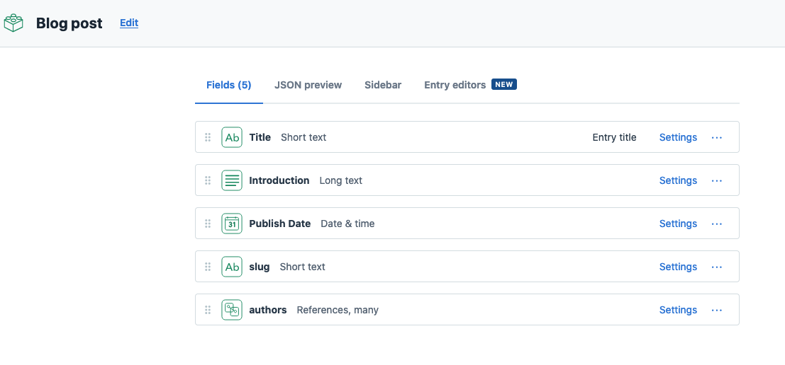

Contentful and Courier MagTag
=====

TODO: Description and Photo

What is this about?
=====

TODO: Description and Screenshot

Getting started
=====

### Requirements

To deploy this project you'll need accounts for the following services:

- [Contentful](https://www.contentful.com)
- [Courier](https://www.courier.com/)
- GitHub

### Setup

* Fork and clone this repository

#### The Contentful part (optional)

This repo currently uses an existing Contentful space that contains a partial export of [the Contentful Blog](https://www.contentful.com/blog/). If you'd like to import this space to your account, so you can modify the content, you're welcome to do so.

* Create a new space using the [Contentful CLI](https://github.com/contentful/contentful-cli)

```console
$ contentful space create --name "magtag-project"
? Do you want to confirm the space creation? Yes
Your user account is a member of multiple organizations. Please select the organization you would like to add your Space to.
? Please select an organization: Shy's DevRel Playground (orgid)
✨  Successfully created space magtag-project (rea8ci0yln66)
```
* Set the newly created space as default space for all further CLI operations. You'll be presented with a list of all available spaces – choose the one you just created.
```console
$ contentful space use
? Please select a space: magtag-project (rea8ci0yln66)
Now using the 'master' Environment of Space magtag-project (rea8ci0yln66) when the `--environment-id` option is missing.
```

* Import the provided content model (`./import/export.json`) into the newly created space.

```console
$ contentful space import --content-file import/export.json

┌──────────────────────────────────────────────────┐
│ The following entities are going to be imported: │
├─────────────────────────────────┬────────────────┤
│ Content Types                   │ 2              │
├─────────────────────────────────┼────────────────┤
│ Editor Interfaces               │ 2              │
├─────────────────────────────────┼────────────────┤
│ Locales                         │ 1              │
├─────────────────────────────────┼────────────────┤
│ Webhooks                        │ 0              │
├─────────────────────────────────┼────────────────┤
│ Entries                         │ 159              │
├─────────────────────────────────┼────────────────┤
│ Assets                          │ 0              │
└─────────────────────────────────┴────────────────┘
 ✔ Validating content-file
 ✔ Initialize client (1s)
 ✔ Checking if destination space already has any content and retrieving it (1s)
 ✔ Apply transformations to source data (1s)
 ✔ Push content to destination space
   ✔ Connecting to space (1s)
   ✔ Importing Locales (1s)
   ✔ Importing Content Types (4s)
   ✔ Publishing Content Types (2s)
   ✔ Importing Editor Interfaces (1s)
   ✔ Importing Assets (4s)
   ✔ Publishing Assets (0s)
   ✔ Archiving Assets (1s)
   ✔ Importing Content Entries (4s)
   ✔ Publishing Content Entries (1s)
   ✔ Archiving Entries (0s)
   ✔ Creating Web Hooks (0s)
Finished importing all data
┌───────────────────────┐
│ Imported entities     │
├───────────────────┬───┤
│ Locales           │ 1 │
├───────────────────┼───┤
│ Content Types     │ 2 │
├───────────────────┼───┤
│ Editor Interfaces │ 2 │
├───────────────────┼───┤
│ Assets            │ 0 │
├───────────────────┼───┤
│ Published Assets  │ 0 │
├───────────────────┼───┤
│ Archived Assets   │ 0 │
├───────────────────┼───┤
│ Entries           │159│
├───────────────────┼───┤
│ Published Entries │ 0 │
├───────────────────┼───┤
│ Archived Entries  │ 0 │
├───────────────────┼───┤
│ Webhooks          │ 0 │
└───────────────────┴───┘
The import took a few seconds (13s)
No errors or warnings occurred
The import was successful.
```

* On Contentful we have 2 Content Types. `author` and `blogPost`.
  * `Author` contains a single field that holds a string with the name of an Author. As authors can have written multiple articles we'll be setting this as a reference in the blogPost Content Type rather than a string. 
  * 
  * `blogPost` contains a Title, the first paragraph of each article in the introduction, a publish date, a slug and references to the previously mention author content model.
  * 

* Update the space id and access token in [secrets.py](secrets.py) to use the api keys from your newly created space.

#### The Courier part (optional)

TODO

#### The MagTag part

TODO

Implementation Notes
=======

TODO

License
=======

Copyright (c) 2021 Contentful GmbH. Code released under the MIT license. See [LICENSE](LICENSE) for further details.
